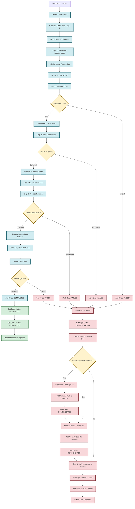
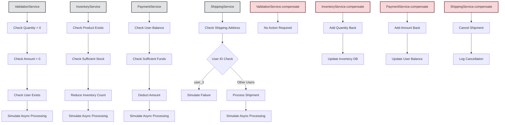
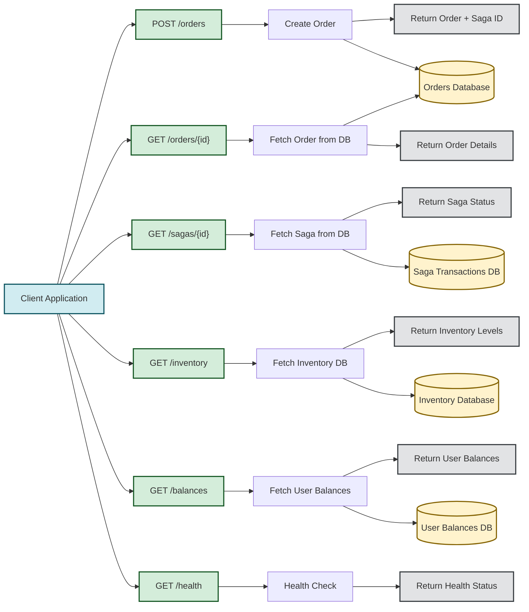
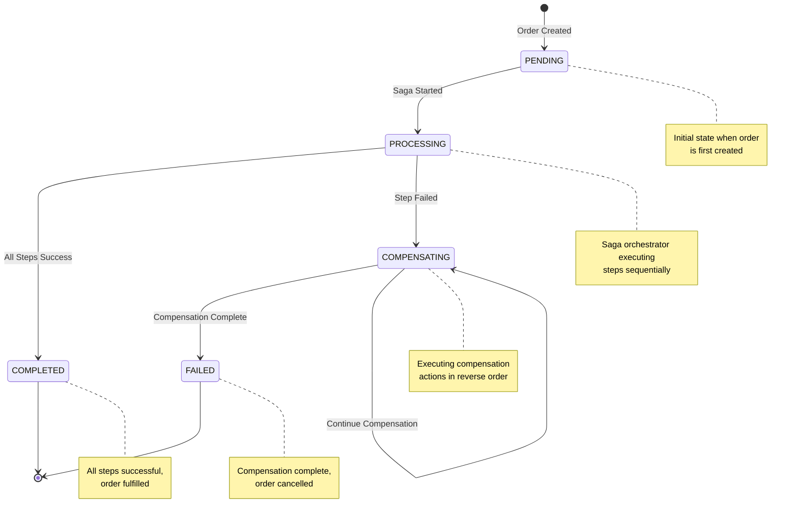
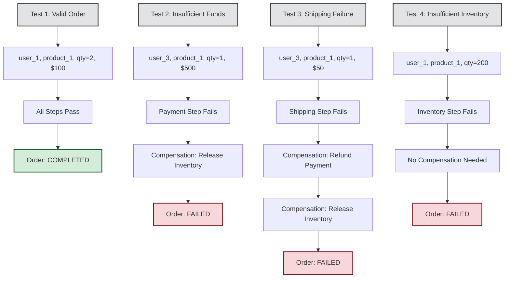

# Saga Pattern Demo - Complete Workflow

This flowchart illustrates the complete Saga Pattern implementation for distributed transaction management in the e-commerce order processing system.

## Main Saga Workflow

## Detailed Service Interactions

## API Endpoints and Data Flow

## Error Handling and Status Transitions

## Test Scenarios Flow

## Key Features Highlighted

- **Orchestrator-based Saga**: Centralized coordination of transaction steps
- **Automatic Compensation**: Failed transactions trigger compensating actions
- **Step-by-step Tracking**: Detailed status tracking for each transaction step
- **Fault Tolerance**: Handles failures gracefully with automatic rollback
- **REST API**: Complete FastAPI implementation with comprehensive endpoints
- **Mock Services**: Simulated inventory, payment, and shipping services
- **Comprehensive Logging**: Detailed logging for debugging and monitoring

The flowchart demonstrates how the Saga Pattern maintains data consistency across distributed services without using traditional ACID transactions, making it ideal for microservices architecture.
