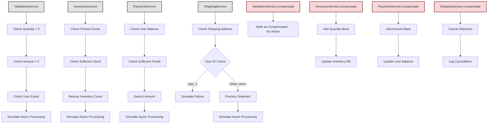
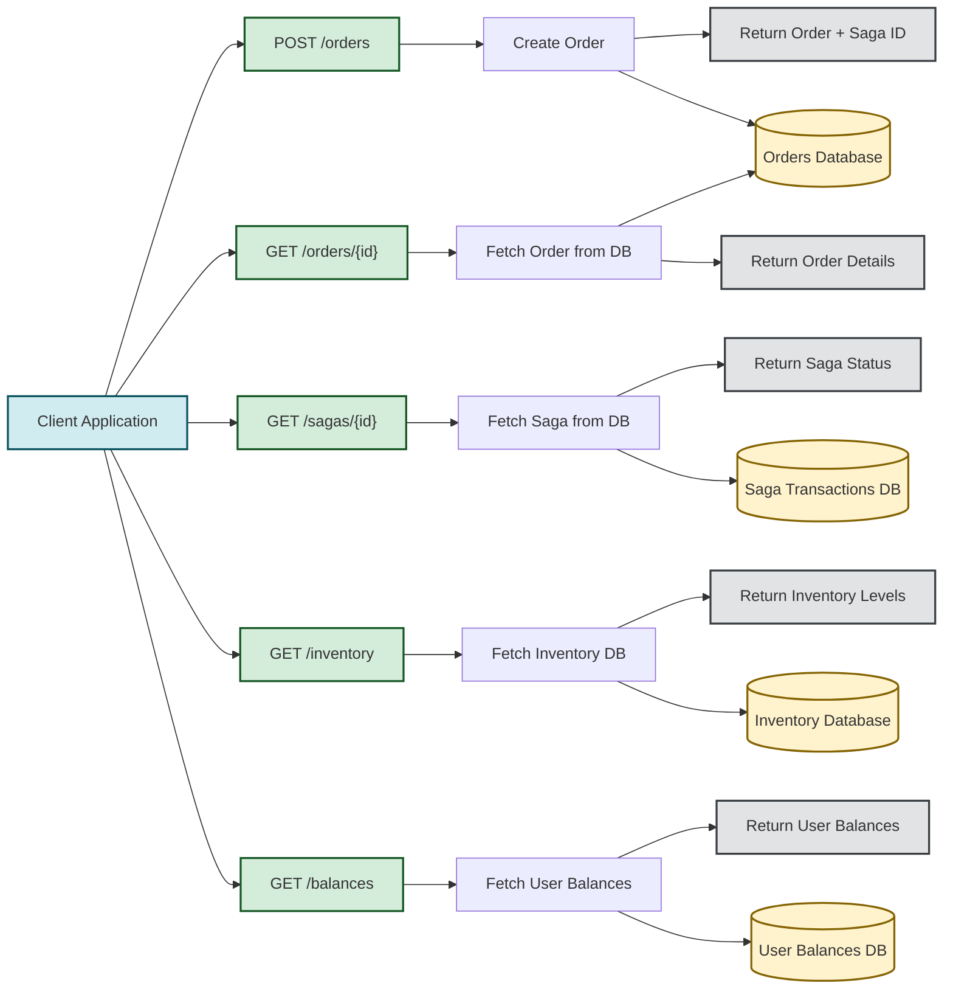
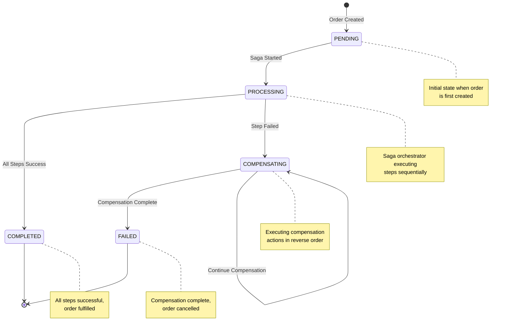
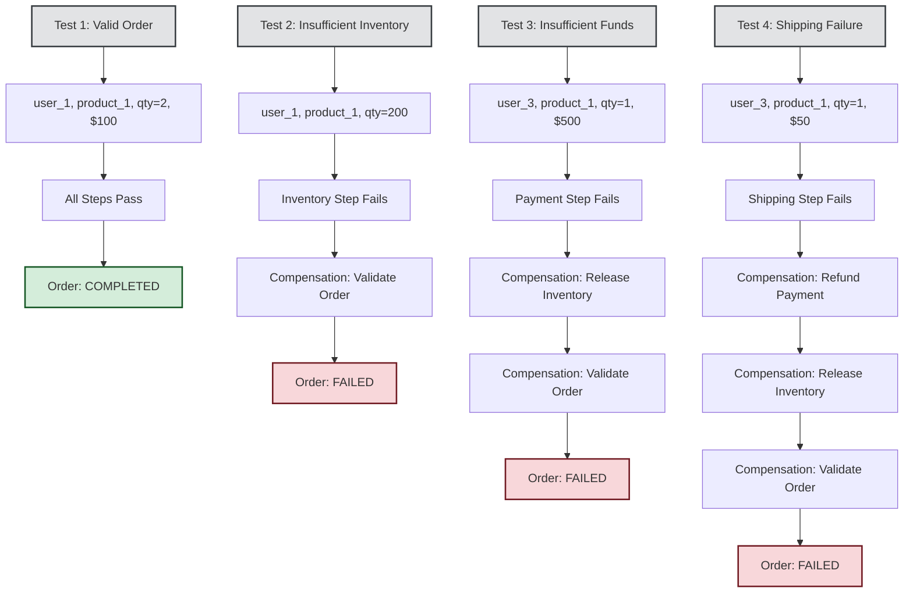
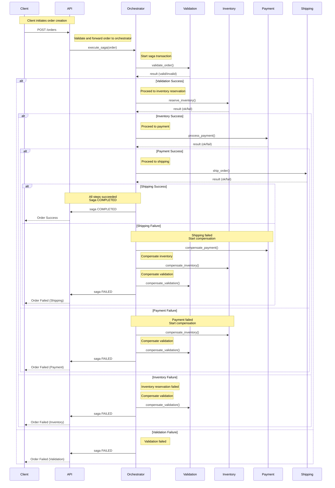

# Saga Pattern Demo - Complete Workflow

## Main Saga Workflow

```mermaid
flowchart TD
    %% API Entry Point
    A[Client POST /orders] --> B[Create Order Object]
    B --> C[Generate Order ID & Saga ID]
    C --> D[Store Order in Database]

    %% Saga Orchestrator Initialization
    D --> E[Saga Orchestrator: execute_saga]
    E --> F[Initialize Saga Transaction]
    F --> G[Set Status: PENDING]

    %% Step 1: Validate Order
    G --> H[Step 1: Validate Order]
    H --> I{Validation Check}
    I -->|Valid| J[Mark Step: COMPLETED]
    I -->|Invalid| K[Mark Step: FAILED]

    %% Step 2: Reserve Inventory
    J --> L[Step 2: Reserve Inventory]
    L --> M{Check Inventory}
    M -->|Sufficient| N[Reduce Inventory Count]
    N --> O[Mark Step: COMPLETED]
    M -->|Insufficient| P[Mark Step: FAILED]

    %% Step 3: Process Payment
    O --> Q[Step 3: Process Payment]
    Q --> R{Check User Balance}
    R -->|Sufficient| S[Deduct Amount from Balance]
    S --> T[Mark Step: COMPLETED]
    R -->|Insufficient| U[Mark Step: FAILED]

    %% Step 4: Ship Order
    T --> V[Step 4: Ship Order]
    V --> W{Shipping Check}
    W -->|Success| X[Mark Step: COMPLETED]
    W -->|Failure| Y[Mark Step: FAILED]

    %% Success Path
    X --> Z[Set Saga Status: COMPLETED]
    Z --> AA[Set Order Status: COMPLETED]
    AA --> BB[Return Success Response]

    %% Failure Paths
    K --> CC[Start Compensation]
    P --> CC
    U --> CC
    Y --> CC

    %% Compensation Flow
    CC --> DD[Set Saga Status: COMPENSATING]
    DD --> EE[Compensate in Reverse Order]

    %% Compensation Steps
    EE --> FF{Previous Steps Completed?}
    FF -->|Ship Completed| GG[Step 4: Cancel Shipment]
    FF -->|Payment Completed| HH[Step 3: Refund Payment]
    FF -->|Inventory Completed| II[Step 2: Release Inventory]
    FF -->|Validation Completed| JJ[Step 1: Mark Compensated]

    GG --> KK[Log Cancellation]
    KK --> LL[Mark Step: COMPENSATED]
    LL --> HH

    HH --> MM[Add Amount Back to Balance]
    MM --> NN[Mark Step: COMPENSATED]
    NN --> II

    II --> OO[Add Quantity Back to Inventory]
    OO --> PP[Mark Step: COMPENSATED]
    PP --> JJ

    JJ --> QQ[Mark Step: COMPENSATED]
    QQ --> RR[Set Saga Status: FAILED]
    RR --> SS[Set Order Status: FAILED]
    SS --> TT[Return Error Response]

    %% Styling
    classDef success fill:#d4edda,stroke:#155724,stroke-width:2px
    classDef failure fill:#f8d7da,stroke:#721c24,stroke-width:2px
    classDef process fill:#d1ecf1,stroke:#0c5460,stroke-width:2px
    classDef decision fill:#fff3cd,stroke:#856404,stroke-width:2px
    classDef compensation fill:#f8d7da,stroke:#721c24,stroke-width:2px

    class Z,AA,BB success
    class K,P,U,Y,RR,SS,TT failure
    class B,C,D,E,F,G,H,J,L,N,O,Q,S,T,V,X process
    class I,M,R,W,FF decision
    class CC,DD,EE,GG,HH,II,JJ,KK,LL,MM,NN,OO,PP,QQ compensation
```

## Detailed Service Interactions

## API Endpoints and Data Flow

## Error Handling and Status Transitions

## Test Scenarios Flow

* **Note:** To simplify the demo, we simulate the Shipping Failure by hardcoding the logic: if the order is placed by `user_3`, and both the product inventory and the user’s balance are sufficient, we intentionally force an error at the final shipping step.

## Sequence Diagram

## Key Features Highlighted

- **Orchestrator-based Saga**: Centralized coordination of transaction steps
- **Automatic Compensation**: Failed transactions trigger compensating actions
- **Step-by-step Tracking**: Detailed status tracking for each transaction step
- **Fault Tolerance**: Handles failures gracefully with automatic rollback
- **REST API**: Complete FastAPI implementation with comprehensive endpoints
- **Mock Services**: Simulated inventory, payment, and shipping services
- **Comprehensive Logging**: Detailed logging for debugging and monitoring

These diagrams demonstrate how the Saga Pattern maintains data consistency across distributed services without using traditional ACID transactions, making it ideal for microservices architecture.
